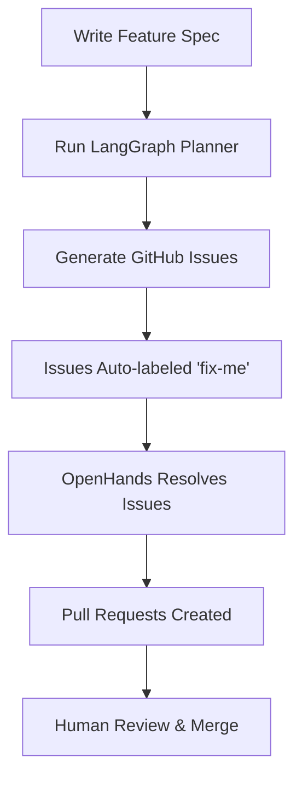

# Garage Inventory Management System

A modern, full-stack inventory management system built with Angular and .NET, designed for managing garage/workshop inventory across multiple locations. This project demonstrates AI-assisted development using OpenHands for automated issue resolution and best practices for human-AI collaboration.

## 🏗️ Architecture

This project follows **Onion Architecture** principles with clear separation of concerns:

### Backend (.NET 9)
- **Domain Layer**: Core business entities and interfaces
- **Application Layer**: Use cases, DTOs, and application services
- **Infrastructure Layer**: Data access, external services, and repositories
- **Presentation Layer**: API controllers and middleware

### Frontend (Angular 20)
- **Standalone Components**: Modern Angular component architecture
- **Angular Material**: Consistent UI components

### Database
- **PostgreSQL**: Primary database with proper normalization
- **Entity Framework Core**: Code-first approach with migrations
- **Soft Deletes**: Audit trail support

## 🚀 Features

### Core Inventory Management
- **Multi-location Support**: Garage, workbench, storage totes, cabinets, shelves, external storage
- **Hierarchical Locations**: Nested location structure (e.g., Garage > Workbench > Drawer 1)
- **Item Categorization**: Flexible category system with hierarchy
- **Rich Item Details**: Brand, model, serial number, condition, purchase info
- **Image Support**: Multiple images per item with primary image selection
- **Movement Tracking**: Complete audit trail of item movements
- **Search & Filter**: Advanced search capabilities with tags and categories

### Authentication & Security
- **JWT Authentication**: Simple token-based auth with future OAuth2/OIDC support
- **Role-based Authorization**: Extensible user role system
- **Password Hashing**: Secure BCrypt password hashing
- **HTTPS Everywhere**: Production-ready security

## 🛠️ Technology Stack

### Backend
- **.NET 9**: Latest .NET framework
- **ASP.NET Core**: Web API framework
- **Entity Framework Core**: ORM with PostgreSQL provider
- **MediatR**: CQRS pattern implementation
- **AutoMapper**: Object-to-object mapping
- **FluentValidation**: Input validation
- **JWT Bearer**: Authentication tokens
- **BCrypt.Net**: Password hashing

### Frontend
- **Angular 20**: Latest Angular framework
- **Angular Material**: UI component library
- **TypeScript**: Type-safe JavaScript
- **SCSS**: Enhanced CSS with variables and mixins
- **RxJS**: Reactive programming

### Infrastructure
- **Docker**: Containerized development and deployment
- **PostgreSQL**: Relational database
- **Redis**: Caching layer (optional)
- **Nginx**: Reverse proxy and static file serving

### AI/Automation
- **LangGraph**: Intelligent task planning and workflow orchestration
- **OpenHands**: Autonomous code implementation and issue resolution
- **OpenAI GPT-4o**: Language model for planning and code generation
- **GitHub Actions**: CI/CD and workflow automation

## 🏃‍♂️ Getting Started

### Prerequisites
- **Node.js 22+**: For Angular development
- **Docker & Docker Compose**: For containerized development
- **.NET 9 SDK**: For local API development (optional with Docker)
- **OpenAI API Key**: For AI planning and code generation
- **GitHub CLI**: For issue creation and management

### Quick Start with Docker

1. **Clone the repository**
   ```bash
   git clone <repository-url>
   cd background-agent-test
   ```

2. **Start the development environment**
   ```bash
   docker-compose up -d
   ```

3. **Access the applications**
   - Frontend: http://localhost:4200
   - API: http://localhost:5000
   - API Documentation: http://localhost:5000/swagger

### Quick Start with AI Workflow

1. **Set up API keys** (add to repository secrets)
   - `OPENAI_API_KEY`: Your OpenAI API key
   - `PAT_TOKEN`: GitHub Personal Access Token with repo and workflow permissions

2. **Create a feature specification**
   ```bash
   # Create a new feature spec
   cp docs/ai/feature-template.md docs/ai/my-new-feature.md
   # Edit the file with your requirements
   ```

3. **Generate issues automatically**
   - Go to **Actions** → **Plan feature into issues**
   - Run workflow with path: `docs/ai/my-new-feature.md`
   - Issues will be created automatically with `fix-me` labels

4. **Watch OpenHands work**
   - OpenHands will automatically start working on labeled issues
   - Monitor progress in the **Actions** tab
   - Review and merge the generated pull requests

### Local Development Setup

#### Backend (.NET API)
```bash
cd src
dotnet restore
dotnet build
dotnet run --project GarageInventory.API
```

#### Frontend (Angular)
```bash
cd frontend
npm install
ng serve
```

#### Database
```bash
# Using Docker
docker run --name garage-db -e POSTGRES_PASSWORD=garage_password -e POSTGRES_USER=garage_user -e POSTGRES_DB=garage_inventory -p 5432:5432 -d postgres:15-alpine

# Or use the docker-compose setup
docker-compose up postgres
```

## 🤖 AI-Powered Development Workflow

This project demonstrates a complete AI-assisted development workflow using **LangGraph** for intelligent planning and **OpenHands** for autonomous code implementation.

## 📋 LangGraph Planning System

The project includes an intelligent planning system built with LangGraph that can break down complex feature specifications into actionable GitHub issues.

### How LangGraph Planning Works

1. **Feature Specification**: Write a detailed feature spec in markdown (see `docs/ai/` for examples)
2. **AI Analysis**: LangGraph analyzes the specification using GPT-4o
3. **Task Breakdown**: Creates atomic, well-defined GitHub issues with:
   - Clear titles and descriptions
   - Acceptance criteria and test requirements
   - Appropriate labels (`api`, `ui`, `infra`, `docs`, `test`)
   - Priority levels (`p1`, `p2`, `p3`)
   - AI-readiness assessment for automated resolution

### Using the Planning System

#### Method 1: GitHub Actions (Recommended)
1. Create a feature specification file in `docs/ai/your-feature.md`
2. Go to **Actions** → **Plan feature into issues**
3. Click **Run workflow** and enter the path to your spec file
4. The system will automatically create labeled GitHub issues

#### Method 2: Local Development
```bash
# Install the planner
cd agents/orchestrator
pip install -e .

# Set your OpenAI API key
export OPENAI_API_KEY="your-api-key"

# Run the planner
plan docs/ai/your-feature.md
```

### Feature Specification Format

Create markdown files in `docs/ai/` following this structure:

```markdown
# Feature Name

## Description
Clear description of what you want to build

## Requirements
- Specific requirement 1
- Specific requirement 2
- etc.

## Acceptance Criteria
- [ ] Criterion 1
- [ ] Criterion 2
- [ ] Tests are included

## Technical Notes
Any architectural considerations or constraints
```

## 🚀 OpenHands Integration

Once issues are created by the planner, OpenHands can automatically resolve them.

### OpenHands Workflow
Issues labeled with `fix-me` automatically trigger the OpenHands agent, which will:
1. Analyze the issue description
2. Implement the required solution
3. Create tests if applicable
4. Commit the changes
5. Automatically create a pull request

### Complete AI Development Flow



### Labels and Automation

The system uses these labels for organization and automation:

- **`fix-me`**: Triggers OpenHands automatic resolution
- **`api`**: Backend API-related tasks
- **`ui`**: Frontend/Angular tasks  
- **`infra`**: Infrastructure, Docker, deployment
- **`docs`**: Documentation updates
- **`test`**: Testing-related tasks
- **`p1/p2/p3`**: Priority levels

### Background Agent Capabilities
- **Autonomous Development**: Agents can work on specific features independently
- **Code Reviews**: Automated code quality checks and suggestions
- **Documentation**: Auto-generation of documentation and comments
- **Testing**: Automated test creation and maintenance
- **Refactoring**: Code optimization and pattern improvements

### Best Practices for AI-Assisted Development

#### Task Assignment
When working with background agents, assign **specific, well-defined tasks**:

✅ **Good Task Examples:**
- "Implement user authentication with JWT tokens"
- "Create inventory item CRUD operations with validation"
- "Add image upload functionality for inventory items"
- "Implement location hierarchy with drag-and-drop reordering"

❌ **Poor Task Examples:**
- "Make the app better"
- "Fix all bugs"
- "Add some features"

#### Agent Collaboration
- **Clear Interfaces**: Define clear contracts between components
- **Integration Tests**: Ensure different agents' work integrates properly
- **Consistent Patterns**: Follow established architectural patterns
- **Documentation**: Maintain up-to-date documentation for cross-agent understanding

### Project Structure for Agents

```
/src                          # .NET Backend
  /GarageInventory.Domain     # → Agent: Domain Modeling
  /GarageInventory.Application # → Agent: Business Logic
  /GarageInventory.Infrastructure # → Agent: Data & External Services
  /GarageInventory.API        # → Agent: API Development
  /GarageInventory.Tests      # → Agent: Testing & QA

/frontend                     # Angular Frontend
  /src/app
    /auth                     # → Agent: Authentication
    /inventory                # → Agent: Inventory Management
    /locations                # → Agent: Location Management
    /shared                   # → Agent: Shared Components
    /core                     # → Agent: Core Services

/docker                       # → Agent: DevOps & Infrastructure
```

## 📁 Project Structure

```
background-agent-test/
├── src/                                    # .NET Backend
│   ├── GarageInventory.Domain/            # Domain entities and interfaces
│   ├── GarageInventory.Application/       # Application services and DTOs
│   ├── GarageInventory.Infrastructure/    # Data access and external services
│   ├── GarageInventory.API/              # Web API controllers
│   └── GarageInventory.Tests/            # Unit and integration tests
├── frontend/                              # Angular Frontend
│   ├── src/app/
│   │   ├── auth/                         # Authentication components
│   │   ├── inventory/                    # Inventory management
│   │   ├── locations/                    # Location management
│   │   ├── layout/                       # Layout components
│   │   ├── core/                         # Core services and guards
│   │   └── shared/                       # Shared components
├── agents/                                # AI Planning System
│   └── orchestrator/                     # LangGraph-based planner
│       ├── planner.py                    # Main planning logic
│       ├── validator_summary.py          # Validation utilities
│       └── pyproject.toml               # Python dependencies
├── docs/ai/                              # Feature specifications
│   ├── feature-template.md              # Template for new features
│   └── simple-test-feature.md           # Example feature spec
├── .github/workflows/                     # GitHub Actions
│   ├── openhands-resolver.yml           # OpenHands automation
│   ├── plan.yml                         # LangGraph planning workflow
│   └── validate.yml                     # Validation workflow
├── database/                              # Database initialization
├── docker-compose.yml                     # Development environment
├── .openhands_instructions               # OpenHands agent instructions
├── .cursorrules                          # AI development guidelines
└── README.md                             # This file
```

## 🧪 Testing Strategy

### Backend Testing
- **Unit Tests**: Domain logic and application services
- **Integration Tests**: API endpoints and database operations
- **Test Coverage**: Minimum 80% for business logic

### Frontend Testing
- **Unit Tests**: Components and services
- **Integration Tests**: Component interactions
- **E2E Tests**: Critical user workflows

## 🚀 Deployment

### Development
```bash
docker-compose up
```

### Production
```bash
docker-compose -f docker-compose.prod.yml up -d
```

## 📝 API Documentation

The API is documented using OpenAPI/Swagger. Once the application is running, visit:
- Development: http://localhost:5000/swagger
- Production: https://your-domain.com/swagger

## 🤝 Contributing

This project demonstrates best practices for AI-assisted development. When contributing:

1. **Follow the .cursorrules**: Established patterns for AI development
2. **Write Clear Commits**: Use conventional commit format
3. **Include Tests**: Maintain test coverage
4. **Update Documentation**: Keep documentation current
5. **Use Background Agents**: Leverage AI for routine tasks

## 📄 License

This project is licensed under the MIT License - see the LICENSE file for details.

## 🙏 Acknowledgments

- Integrated with OpenHands for automated issue resolution
- Built with AI-assisted development tools
- Demonstrates modern .NET and Angular development practices
- Showcases effective human-AI collaboration in software development